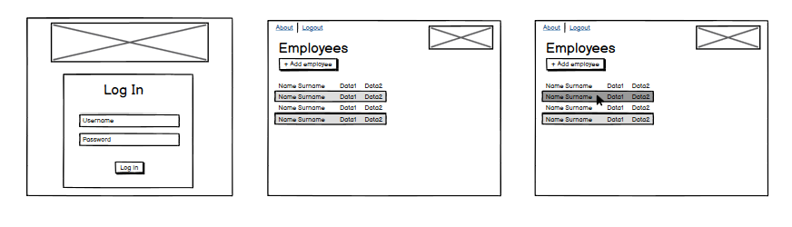
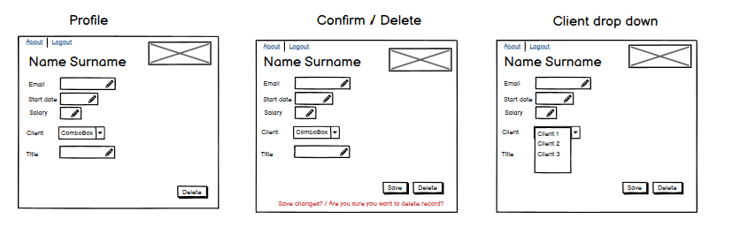
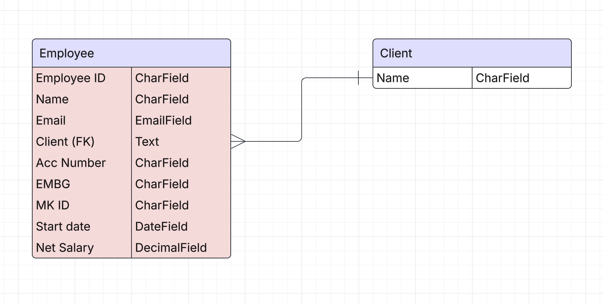
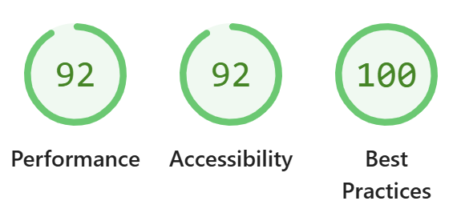
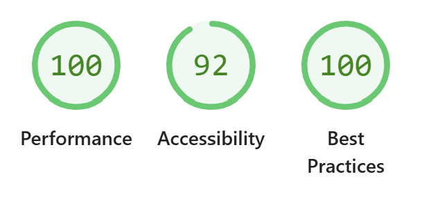

# Talkr Portal

## UX Design Process

### Wireframes

Below are the wireframes representing the initial design concepts for the Talkr Login and Portal interface:

1. 
2. 

---

### Design Rationale

#### Layout

The layout follows a clear hierarchy with a consistent navigation structure. Content is grouped logically and using a table for ease of scanning and interaction.

#### Color Scheme

A minimal and high-contrast color palette was chosen to reduce visual clutter and enhance readability, using a lot of white space. Accent colors are used sparingly to draw attention to calls to action - intuitively allowing the user to know the submit button vs delete vs cancel.

#### Typography

Sans-serif fonts were selected for a modern and clean appearance. A consistent font scale ensures readability across devices, with distinct weights used to establish hierarchy.

#### Accessibility

- All interactive elements have a minimum target size of 44x44px.
- Colors meet WCAG AA contrast requirements.
- Semantic HTML elements are used for screen reader compatibility.
- ARIA labels are included where necessary.

---

## Key Features

| Feature              | Function                                            | Result                                          |
|----------------------|-----------------------------------------------------|-------------------------------------------------|
| User Authentication  | Secure login/signup using Django                    | Ensures only authorized users can access portal |
| Employee list        | Displays a list if employees with key data          | Ensures easy scanning and quick checking        |
| Add Employee         | Allows users to add an employee                     | Keeps the portal up to date                     |
| Edit Employee        | Allows users to edit employee detail                | Keeps the portal up to date                     |
| Create users         | Using Django admin create new users                 | Ensures access control for new users            |

---

## Entity Relationship Diagram

- Clear one-to-many relationship between client and employees.
- Clear one-to-one relationship between employee and client.
- Keys and constraints defined for data integrity.

---

## Deployment

The Talkr Portal is deployed using Heroku. Continuous deployment is enabled through GitHub integration. The app is accessible at:

🔗 [https://talkrportal-6cf86883a4fe.herokuapp.com/portal/](https://talkrportal-6cf86883a4fe.herokuapp.com/portal/)

---

## AI Implementation and Orchestration

AI was used throughout the build of this portal - utilising co-pilot for help with the code. ChatGpt for help with the user stories and README.

---

## Testing and Checking

### WC3 Checker

- ✅ HTML passes W3C Markup Validation
- ✅ CSS passes W3C CSS Validation

### Lighthouse

#### Mobile

- 

#### Desktop

- 

### Testing Summary

- Manual Testing: Tested cresting a number of users, employees and clients. This involved both via the portal and Django admin. In addition to this, Google Developer tools were used too observe the design on different device to ensure responsiveness.

---

## Future Iterations

Planned improvements include filtering the employee list page, 2FA for login, allowing documents to be saved within employee profile page and a notes section.

---