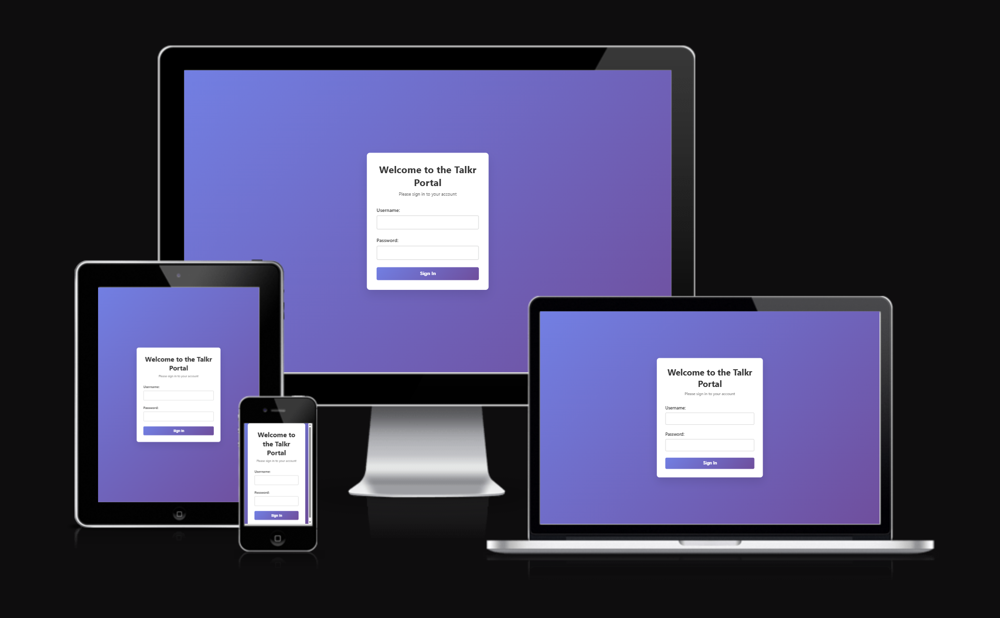

# Talkr Portal

## UX Design Process

### Wireframes

Below are the wireframes representing the initial design concepts for the Talkr Login and Portal interface:

1. 
2. 

---

### Design Rationale

#### Layout

The layout follows a clear hierarchy with a consistent navigation structure. Content is grouped logically and using a table for ease of scanning and interaction.

#### Color Scheme

A minimal and high-contrast color palette was chosen to reduce visual clutter and enhance readability, using a lot of white space. Accent colors are used sparingly to draw attention to calls to action - intuitively allowing the user to know the submit button vs delete vs cancel.

#### Typography

Sans-serif fonts were selected for a modern and clean appearance. A consistent font scale ensures readability across devices, with distinct weights used to establish hierarchy.

#### Accessibility

- All interactive elements have a minimum target size of 44x44px.
- Colors meet WCAG AA contrast requirements.
- Semantic HTML elements are used for screen reader compatibility.
- ARIA labels are included where necessary.

---

## Key Features

| Feature              | Function                                            | Result                                          |
|----------------------|-----------------------------------------------------|-------------------------------------------------|
| User Authentication  | Secure login/signup using Django                    | Ensures only authorized users can access portal |
| Employee list        | Displays a list if employees with key data          | Ensures easy scanning and quick checking        |
| Add Employee         | Allows users to add an employee                     | Keeps the portal up to date                     |
| Edit Employee        | Allows users to edit employee detail                | Keeps the portal up to date                     |
| Create users         | Using Django admin create new users                 | Ensures access control for new users            |

---

## Entity Relationship Diagram

- Clear one-to-many relationship between client and employees.
- Clear one-to-one relationship between employee and client.
- Keys and constraints defined for data integrity.

---

## Deployment

The Talkr Portal is deployed using Heroku. Continuous deployment is enabled through GitHub integration. The app is accessible at:

🔗 [https://talkrportal-6cf86883a4fe.herokuapp.com/portal/](https://talkrportal-6cf86883a4fe.herokuapp.com/portal/)

---

## AI Implementation and Orchestration

AI was used throughout the build of this portal - utilising co-pilot for help with the code. ChatGpt for help with the user stories and README.

---

## Testing and Checking

### WC3 Checker

- ✅ HTML passes W3C Markup Validation
- ✅ CSS passes W3C CSS Validation

### Lighthouse

#### Mobile

#### Desktop

### Testing Summary

## Manual Testing Summary

| Test Case ID | Test Area                  | Description | Steps | Expected Result | Actual Result | Status |
|--------------|----------------------------|-------------|-------|-----------------|---------------|--------|
| TC-001       | Login Functionality         | Verify user login with valid and invalid credentials | 1. Open login page 2. Enter valid credentials 3. Submit form 4. Repeat with invalid credentials | Successful login for valid credentials; error message for invalid credentials | Behaviour matched expectations; no errors found | ✅ Pass |
| TC-002       | Logout Functionality        | Verify logout terminates session and redirects to login page | 1. Login to portal 2. Click logout button in navbar 3. Observe redirection | User is logged out and redirected to login page | Behaviour matched expectations; session cleared | ✅ Pass |
| TC-003       | User Management (Admin)     | Test creating, editing, deleting users via Django admin | 1. Open Django admin 2. Create new user 3. Edit details 4. Delete user | CRUD operations work and changes persist | All actions successful; data reflected correctly in database | ✅ Pass |
| TC-004       | Employee & Client CRUD      | Test creating, editing, deleting employees & clients via portal | 1. Open portal 2. Add new employee/client 3. Edit record 4. Delete record | CRUD operations function as intended | All tests passed; data updated correctly | ✅ Pass |
| TC-005       | Form Validation             | Ensure invalid or incomplete submissions are blocked | 1. Leave required fields empty 2. Enter invalid data 3. Submit form | Validation errors displayed; form not submitted | Validation worked as expected | ✅ Pass |
| TC-006       | Responsive Design           | Verify layout adapts to different devices | 1. Open portal in Chrome DevTools 2. Test various screen sizes 3. Check table and navbar behavior | Content adapts; tables scroll on small screens; navigation remains accessible | Responsive design works correctly | ✅ Pass |
| TC-007       | Navigation Links            | Verify that all navigation links work | 1. Click each navbar link 2. Confirm page loads without error | All pages load correctly | No broken links found | ✅ Pass |

---

## Future Iterations

Planned iterations include reset password user journey, filtering the employee list page, 2FA for login, allowing documents to be saved within employee profile page and a notes section.

---